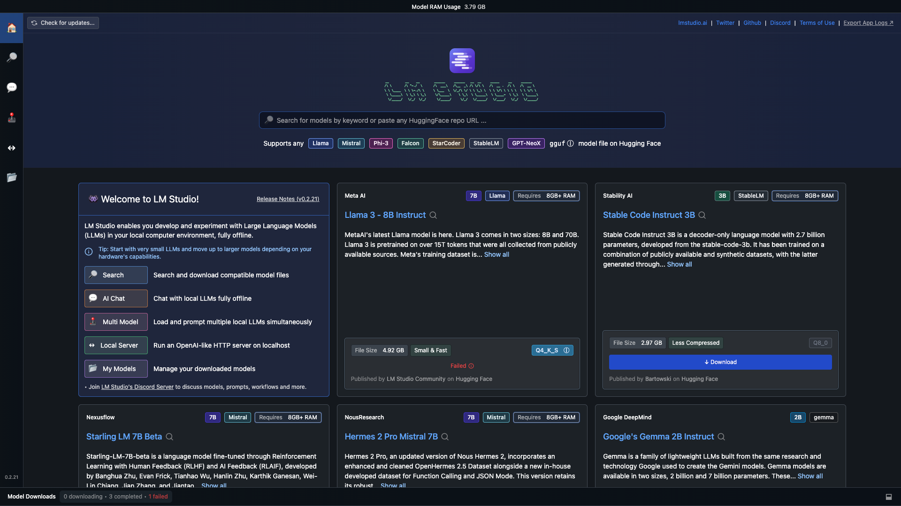
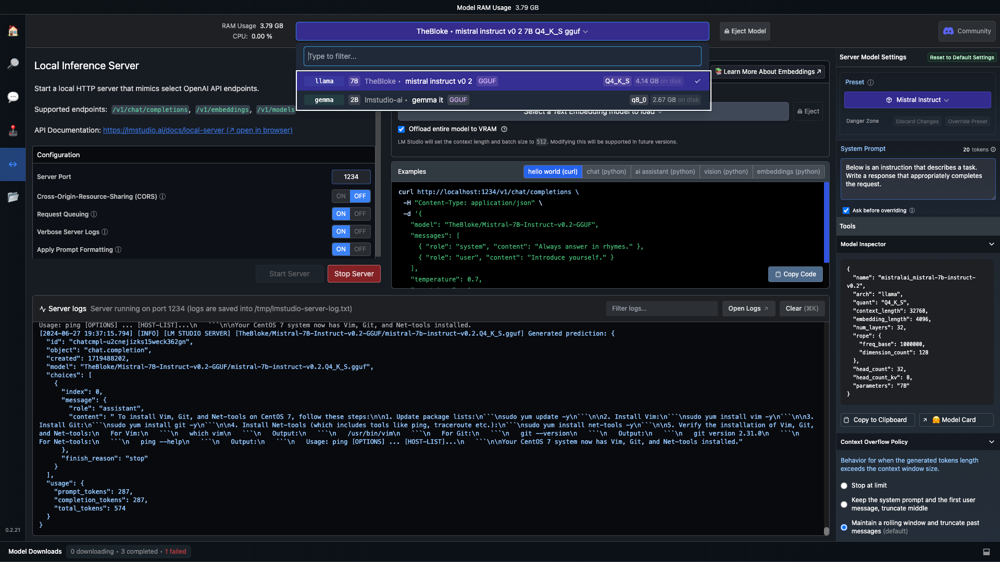
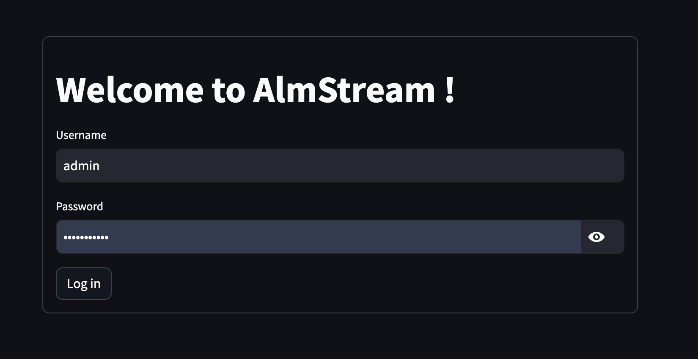
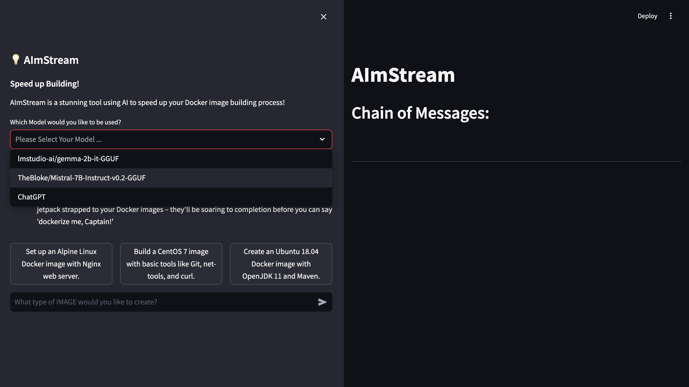
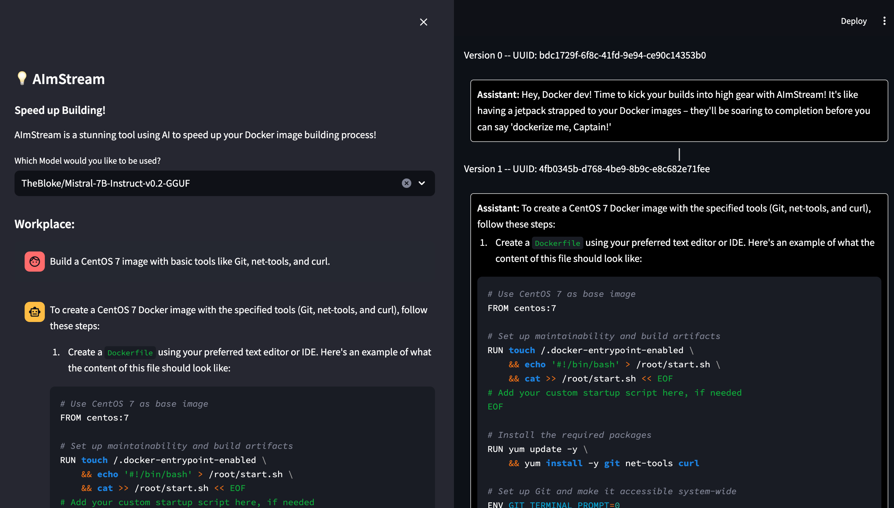

# AImStream

Well...well...well..., the demand for speed and efficiency in software development is at an all-time high. So, I took a detour from my regular coding routine and whipped up this side project called "AImStream".

AImStream is here to help you build Docker images like a boss, integrating the power of Artificial Intelligence to streamline and accelerate your workflow. Let's dive into the details!

## What is AImStream?
#### AImStream: Where AI meets Docker and says, "Hold my coffee!"
AImStream is the tech world's answer to the question, "What if we could make Docker image building not just faster, but ridiculously, mind-blowingly faster?" It's like giving your build process a shot of espresso, but for some reason, it's legal and doesn't cause heart palpitations.

## Installation
1. Make sure you have `LM Studio` and `Python` installed on your system.
**LM Studio** 👉 : https://lmstudio.ai/docs/welcome
2. Clone the AImStream repository:
```shell
git clone https://github.com/oasisnoehub/AImStream.git
```
3. Navigate into the AImStream directory:
```shell
cd AImStream
```
4. Install the required Python packages:
```shell
pip install -r requirements.txt
```
5. Install the local LLMs models in the LM Studio:



Select open source models in the LM Studio and run the model as a backend server:




## Usage
To use AImStream :
1. Start the AImStream service ( ⚠️ make sure you have installed the streamlit library):
```shell
streamlit run almstream_app.py
```
2. Lgin in the local AImStream webapp at http://localhost:8501 :



```shell
username: admin
password: p@ssw0rdyyl
```
3. Try it yourself 👇 !





### Contributing
We welcome contributions to AImStream! **If you are interested in this project and want to integrate AI into your workflow, please feel free to connect me for more details.**

### License
AImStream is released under the `MIT License`.

### Contact
Have questions or feedback? Reach out to us or create an issue in this repository.
😊 Email me at: `yinyiling03@gmail.com`


And there you have it! AImStream is ready to help you supercharge your Docker image building process. Let's make software development a breeze together! 🚀💨


